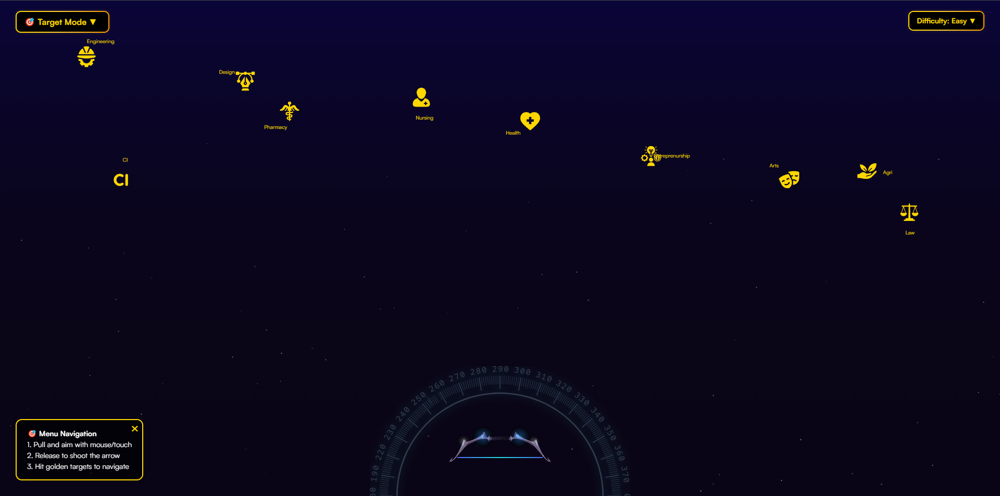

# 🏹 Gamify Menu 🎯

A **cinematic, gamified website navigation system** where users interact using a bow-and-arrow mechanism to hit floating menu icons. Designed with interactive animation, dynamic sound effects, and mobile responsiveness — this menu system turns navigation into a game.

---

## 📸 Preview

 <!-- Replace with your actual screenshot path -->

---

## 🚀 Features

- 🎯 **Target Mode**: Select and shoot a floating menu icon to navigate.
- 🧠 **Difficulty Mode**: Adjust animation speed with emoji-based modes: 🤣 Noob, 🙂 Easy, 🥶 Veteran.
- 🏹 **Hold-to-Fire Mechanic**: Press and hold mouse or touch to draw the arrow and release to shoot.
- 🔊 **Custom Sounds**: Fire, hit, miss, and difficulty change sounds.
- ✨ **Visual Feedback**:
  - Explosion particles on hit
  - Emoji rain when switching difficulty
  - Glow and hover states for interactivity
- 📱 **Mobile & Tablet Ready**: Responsive layout with toggle buttons (🎯, 🧠) instead of full dropdowns.
- 📍 **Compass & Cinematic Elements**: Decorative SVG compass and atmospheric UI.

---

## 📁 Folder Structure
 ```
│
├── assets/ # All images, icons, SVGs, audio
│ ├── arrow.svg
│ ├── compass.svg
│ ├── icon1.svg ...
│ ├── bg-music.mp3
│ └── shoot.mp3, hit.mp3, miss.mp3, etc.
│
├── index.html # Main HTML file
├── style.css # Complete visual styling (desktop + mobile)
├── script.js # All interaction logic, physics, UI control
└── README.md # This file!
 ```
